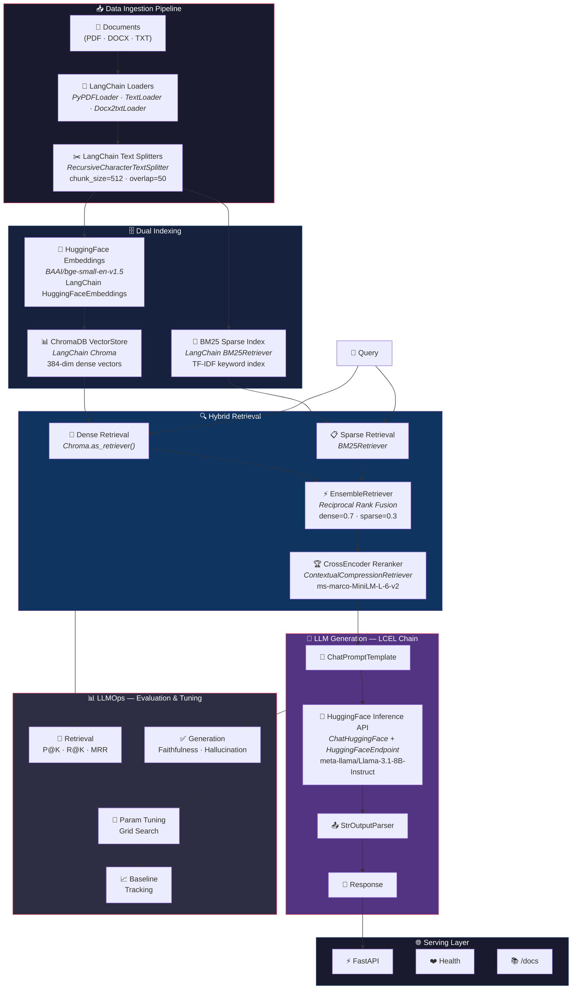

<p align="center">
  <h1 align="center">🧠 Advanced RAG System</h1>
  <p align="center">
    <strong>Production-grade Retrieval-Augmented Generation with LangChain orchestration & HuggingFace models</strong>
  </p>
  <p align="center">
    
    
    
    
    
    
  </p>
</p>

---

## 🏗️ System Architecture

> Full LLMOps pipeline: **Ingest → Index → Retrieve → Generate → Evaluate → Tune**



### LCEL Chain Pattern (core generation pipeline)

```python
# LangChain Expression Language — composable, streamable, observable
chain = (
    {"context": retriever | format_docs, "query": RunnablePassthrough()}
    | ChatPromptTemplate(system + context + query)
    | ChatHuggingFace(HuggingFaceEndpoint("meta-llama/Llama-3.1-8B-Instruct"))
    | StrOutputParser()
)
answer = chain.invoke("What is retrieval-augmented generation?")
```

---

## 🧩 LangChain & HuggingFace Components Map

Every module in this project maps directly to a **LangChain** component, with **HuggingFace** models powering embeddings, reranking, and generation:

| Module | LangChain Component | HuggingFace Model |
|--------|--------------------|--------------------|
| `src/data/loader.py` | `PyPDFLoader` · `TextLoader` · `Docx2txtLoader` | — |
| `src/data/processor.py` | `RecursiveCharacterTextSplitter` | — |
| `src/retrieval/embeddings.py` | `HuggingFaceEmbeddings` | **BAAI/bge-small-en-v1.5** |
| `src/retrieval/vector_store.py` | `langchain_chroma.Chroma` | — |
| `src/retrieval/bm25_retriever.py` | `BM25Retriever` | — |
| `src/retrieval/hybrid_retriever.py` | `EnsembleRetriever` (Reciprocal Rank Fusion) | — |
| `src/retrieval/reranker.py` | `ContextualCompressionRetriever` + `CrossEncoderReranker` | **cross-encoder/ms-marco-MiniLM-L-6-v2** |
| `src/generation/llm.py` | `ChatHuggingFace` + `HuggingFaceEndpoint` | **meta-llama/Llama-3.1-8B-Instruct** |
| `src/generation/chain.py` | LCEL: `RunnablePassthrough` → `ChatPromptTemplate` → `StrOutputParser` | — |
| `src/generation/prompts.py` | `ChatPromptTemplate.from_messages()` | — |
| `src/api/main.py` | FastAPI serving layer | — |

### LLM Backend (dual support)

```
┌─────────────────────────────────────────────────────────────┐
│  LLM_BACKEND=huggingface (default)                         │
│  ┌───────────────────┐    ┌──────────────────────────────┐  │
│  │ HuggingFaceEndpoint│───▶│ ChatHuggingFace              │  │
│  │ (Inference API)   │    │ meta-llama/Llama-3.1-8B      │  │
│  └───────────────────┘    └──────────────────────────────┘  │
├─────────────────────────────────────────────────────────────┤
│  LLM_BACKEND=ollama (fallback)                             │
│  ┌───────────────────┐    ┌──────────────────────────────┐  │
│  │ Ollama Server     │───▶│ ChatOllama                    │  │
│  │ (localhost:11434) │    │ llama3.1:8b                   │  │
│  └───────────────────┘    └──────────────────────────────┘  │
└─────────────────────────────────────────────────────────────┘
```

---

## ⚡ Quick Start

```bash
# 1. Clone & setup
git clone https://github.com/AMINAATTAOUI/advanced-rag-system.git
cd advanced-rag-system
python -m venv .venv && .venv\Scripts\activate  # Windows
# source .venv/bin/activate                     # Linux/Mac

# 2. Install dependencies
pip install -r requirements.txt

# 3. Configure HuggingFace API
cp .env.example .env
# Edit .env → add your HF_API_TOKEN from https://huggingface.co/settings/tokens
# Free tier is sufficient for inference

# 4. Download & index documents (example: ArXiv papers)
python scripts/download_data.py --num-papers 50
python scripts/build_index.py

# 5. Verify the full pipeline
python tests/test_system.py

# 6. Start API server
python -m uvicorn src.api.main:app --reload --port 8000
# → http://localhost:8000/docs
```

---

## 📊 LLMOps — Evaluation & Baseline Metrics

A core LLMOps practice: **measure before you tune**. This system includes a full evaluation suite with baseline tracking and regression detection.

### Achieved Baseline (50 PDFs, 20 eval queries)

| Category | Metric | Score | Status |
|----------|--------|-------|--------|
| **Retrieval** | Precision@5 | **0.850** | ✅ EXCELLENT |
| | Recall@5 | **0.900** | ✅ EXCELLENT |
| | MRR | **0.900** | ✅ EXCELLENT |
| | Avg Latency | 49ms (p95: 66ms) | ⚡ FAST |
| **Generation** | Faithfulness | **0.975** | ✅ EXCELLENT |
| | Answer Relevance | **0.824** | ✅ GOOD |
| | Context Precision | **0.790** | ✅ GOOD |
| | Hallucination Rate | **0.025** | ✅ EXCELLENT |
| **System** | Overall | **PRODUCTION READY** | ✅ |

### Evaluation Commands

```bash
# Step 1: Capture baseline (run after indexing)
python tests/test_baseline_metrics.py --dataset_size 50 --save_results

# Step 2: Evaluate retrieval (compare dense vs sparse vs hybrid)
python tests/test_evaluate_retrieval.py --method hybrid --top_k 5
python tests/test_evaluate_retrieval.py --method dense --top_k 5
python tests/test_evaluate_retrieval.py --method sparse --top_k 5

# Step 3: Evaluate generation quality
python tests/test_evaluate_generation.py --method hybrid --num_queries 20

# Step 4: Parameter tuning (LLMOps iterative optimization)
python scripts/tune_parameters.py --param chunk_size --values 256,512,1024
python scripts/failure_analysis.py --threshold 0.6
python tests/test_score_thresholds.py --thresholds 0.3,0.5,0.7
```

### LLMOps Workflow

```
 ┌──────────┐    ┌──────────┐    ┌──────────┐    ┌──────────┐
 │ Baseline │───▶│ Evaluate │───▶│  Tune    │───▶│ Validate │
 │ Capture  │    │ Metrics  │    │ Params   │    │ No Regr. │
 └──────────┘    └──────────┘    └──────────┘    └──────────┘
       │                                               │
       └───────────────── Loop ◀───────────────────────┘
```

---

## 📁 Project Structure

```
advanced-rag-system/
├── src/
│   ├── data/
│   │   ├── loader.py              # LangChain Document Loaders (PDF, DOCX, TXT)
│   │   └── processor.py           # LangChain RecursiveCharacterTextSplitter
│   ├── retrieval/
│   │   ├── embeddings.py          # LangChain HuggingFaceEmbeddings (bge-small-en-v1.5)
│   │   ├── vector_store.py        # LangChain Chroma VectorStore
│   │   ├── bm25_retriever.py      # LangChain BM25Retriever (sparse)
│   │   ├── hybrid_retriever.py    # LangChain EnsembleRetriever (RRF fusion)
│   │   └── reranker.py            # LangChain ContextualCompressionRetriever + CrossEncoder
│   ├── generation/
│   │   ├── llm.py                 # ChatHuggingFace / ChatOllama (dual backend)
│   │   ├── chain.py               # LCEL RAG Chain (prompt | llm | parser)
│   │   └── prompts.py             # ChatPromptTemplate definitions
│   ├── api/
│   │   └── main.py                # FastAPI REST + streaming endpoints
│   └── utils/
│       ├── logger.py              # Structured logging (loguru)
│       └── cache.py               # Query result caching
├── scripts/
│   ├── download_data.py           # ArXiv paper downloader
│   ├── build_index.py             # Build ChromaDB + BM25 indices
│   ├── generate_eval_dataset.py   # Auto-generate evaluation queries
│   ├── tune_parameters.py         # Automated parameter grid search
│   └── failure_analysis.py        # Error pattern analysis
├── tests/
│   ├── test_system.py             # End-to-end integration test
│   ├── test_langchain_imports.py  # LangChain component smoke tests (20 tests)
│   ├── test_baseline_metrics.py   # Baseline capture & regression detection
│   ├── test_evaluate_retrieval.py # P@K, R@K, MRR evaluation
│   ├── test_evaluate_generation.py# Faithfulness, relevance, hallucination
│   └── test_score_thresholds.py   # Score threshold optimization
├── data/
│   ├── raw/                       # Source documents (PDFs)
│   ├── processed/                 # BM25 index (pickle)
│   ├── vector_db/                 # ChromaDB persistent storage
│   └── test/                      # Evaluation dataset (JSON)
├── .env                           # HF_API_TOKEN, LLM_BACKEND config
├── requirements.txt               # LangChain ecosystem dependencies
└── results/                       # Baseline metrics & evaluation reports
```

---

## 🔧 Configuration (`.env`)

```env
# LLM Backend (HuggingFace Inference API — default)
LLM_BACKEND=huggingface
HF_MODEL=meta-llama/Llama-3.1-8B-Instruct
HF_API_TOKEN=hf_xxxxx                          # https://huggingface.co/settings/tokens

# Embeddings (HuggingFace)
EMBEDDING_MODEL=BAAI/bge-small-en-v1.5

# Reranker (HuggingFace CrossEncoder)
RERANKER_MODEL=cross-encoder/ms-marco-MiniLM-L-6-v2

# Hybrid Retrieval Fusion
DENSE_WEIGHT=0.7
SPARSE_WEIGHT=0.3
CHUNK_SIZE=512
CHUNK_OVERLAP=50

# Ollama Fallback (local, offline)
OLLAMA_MODEL=llama3.1:8b
OLLAMA_BASE_URL=http://localhost:11434
```

---

## 📖 Documentation

| Guide | Description |
|-------|-------------|
| [GETTING_STARTED.md](GETTING_STARTED.md) | Full setup → testing → tuning → production workflow |
| [PARAMETER_TUNING.md](PARAMETER_TUNING.md) | Systematic parameter tuning & evaluation methodology |
| [API_REFERENCE.md](API_REFERENCE.md) | REST API endpoints, request/response examples & streaming |
| [TROUBLESHOOTING.md](TROUBLESHOOTING.md) | Common issues & solutions |

---

## 🎯 Target vs Achieved Performance

| Metric | Target | Achieved | Status |
|--------|--------|----------|--------|
| Precision@5 | > 0.85 | 0.850 | ✅ |
| Answer Faithfulness | > 0.90 | 0.975 | ✅ |
| Hallucination Rate | < 0.05 | 0.025 | ✅ |
| Response Time (p95) | < 8s | 66ms | ✅ |
| Memory Usage | < 8GB | ~4GB | ✅ |

---

## License

MIT License
