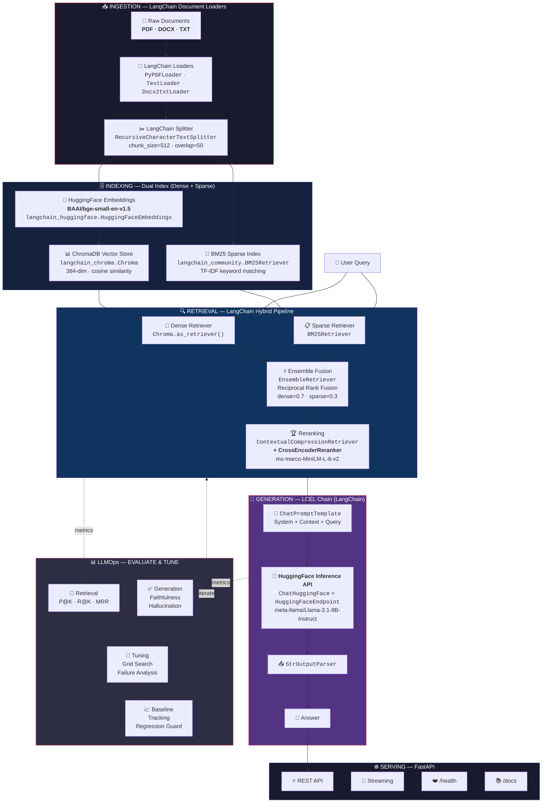

<p align="center">
  <h1 align="center">🧠 Advanced RAG System</h1>
  <p align="center">
    <strong>Production-grade Retrieval-Augmented Generation built entirely on LangChain + HuggingFace</strong>
  </p>
  <p align="center">
    
    
    
    
    
    
    
  </p>
</p>

An end-to-end RAG system following **LLMOps best practices**: every component is orchestrated via **LangChain**, every model is served through **HuggingFace** (embeddings, reranker, LLM), and the full lifecycle — ingestion, indexing, retrieval, generation, evaluation, tuning — is covered with production tooling.

---

## 🏗️ System Architecture



### Core LCEL Pipeline (LangChain Expression Language)

```python
# The entire RAG chain in one composable, streamable expression
chain = (
    {"context": retriever | format_docs, "query": RunnablePassthrough()}
    | ChatPromptTemplate.from_messages([system_msg, human_msg])
    | ChatHuggingFace(llm=HuggingFaceEndpoint(repo_id="meta-llama/Llama-3.1-8B-Instruct"))
    | StrOutputParser()
)
answer = chain.invoke("What is retrieval-augmented generation?")
```

---

## 🧩 LangChain × HuggingFace — Components Map

Every module maps to a **LangChain** component. All models are served via **HuggingFace**:

| Layer | Module | LangChain Component | HuggingFace Model |
|-------|--------|--------------------|--------------------|
| **Ingestion** | `src/data/loader.py` | `PyPDFLoader` · `TextLoader` · `Docx2txtLoader` | — |
| **Ingestion** | `src/data/processor.py` | `RecursiveCharacterTextSplitter` | — |
| **Indexing** | `src/retrieval/embeddings.py` | `HuggingFaceEmbeddings` | `BAAI/bge-small-en-v1.5` |
| **Indexing** | `src/retrieval/vector_store.py` | `langchain_chroma.Chroma` | — |
| **Retrieval** | `src/retrieval/bm25_retriever.py` | `BM25Retriever` | — |
| **Retrieval** | `src/retrieval/hybrid_retriever.py` | `EnsembleRetriever` (RRF) | — |
| **Retrieval** | `src/retrieval/reranker.py` | `ContextualCompressionRetriever` + `CrossEncoderReranker` | `cross-encoder/ms-marco-MiniLM-L-6-v2` |
| **Generation** | `src/generation/llm.py` | `ChatHuggingFace` + `HuggingFaceEndpoint` | `meta-llama/Llama-3.1-8B-Instruct` |
| **Generation** | `src/generation/chain.py` | LCEL: `RunnablePassthrough` → `PromptTemplate` → `StrOutputParser` | — |
| **Generation** | `src/generation/prompts.py` | `ChatPromptTemplate.from_messages()` | — |
| **Serving** | `src/api/main.py` | FastAPI | — |

### 3 HuggingFace Models Used

```
┌───────────────────────────────────────────────────────────────────┐
│                    HuggingFace Model Hub                         │
├───────────────┬───────────────────────────┬───────────────────────┤
│  Embeddings   │  Reranking                │  LLM (Generation)    │
│               │                           │                      │
│  BAAI/        │  cross-encoder/           │  meta-llama/         │
│  bge-small-   │  ms-marco-               │  Llama-3.1-8B-       │
│  en-v1.5      │  MiniLM-L-6-v2           │  Instruct            │
│               │                           │                      │
│  384-dim      │  CrossEncoder             │  Inference API       │
│  local CPU    │  local CPU                │  cloud (free tier)   │
├───────────────┼───────────────────────────┼───────────────────────┤
│  LangChain:   │  LangChain:              │  LangChain:          │
│  HuggingFace  │  CrossEncoderReranker    │  ChatHuggingFace +   │
│  Embeddings   │  + Contextual            │  HuggingFaceEndpoint │
│               │  CompressionRetriever    │                      │
└───────────────┴───────────────────────────┴───────────────────────┘
```

---

## ⚡ Quick Start

### Prerequisites

- Python 3.10+
- A free HuggingFace account → [Get API token](https://huggingface.co/settings/tokens)

### Setup

```bash
# 1. Clone
git clone https://github.com/AMINAATTAOUI/advanced-rag-system.git
cd advanced-rag-system

# 2. Virtual environment
python -m venv .venv
.venv\Scripts\activate          # Windows
# source .venv/bin/activate     # Linux/Mac

# 3. Install dependencies
pip install -r requirements.txt

# 4. Configure HuggingFace token
cp .env.example .env
# Edit .env → set HF_API_TOKEN=hf_your_token_here
```

### Run

```bash
# 5. Download documents (example: 50 ArXiv papers)
python scripts/download_data.py --num-papers 50

# 6. Build indices (ChromaDB vectors + BM25 sparse)
python scripts/build_index.py

# 7. Verify full pipeline
python tests/test_system.py

# 8. Start API
python -m uvicorn src.api.main:app --reload --port 8000
# → Open http://localhost:8000/docs
```

### Query

```bash
curl -X POST "http://localhost:8000/query" \
  -H "Content-Type: application/json" \
  -d '{"query": "What are the main contributions of this paper?", "top_k": 5}'
```

---

## 📊 LLMOps — Evaluation Pipeline

> **LLMOps best practice**: measure → tune → validate → repeat.

### LLMOps Lifecycle

```
   ┌────────────┐     ┌────────────┐     ┌────────────┐     ┌────────────┐
   │  BASELINE   │────▶│  EVALUATE   │────▶│    TUNE     │────▶│  VALIDATE   │
   │  Capture    │     │  Retrieval  │     │  chunk_size │     │  No regres- │
   │  metrics    │     │  Generation │     │  weights    │     │  sion check │
   └────────────┘     └────────────┘     │  thresholds │     └─────┬──────┘
        ▲                                 └────────────┘           │
        └──────────────────── iterate ◀────────────────────────────┘
```

### Baseline Metrics (achieved)

| Category | Metric | Score | Assessment |
|----------|--------|-------|------------|
| **Retrieval** | Precision@5 | **0.850** | ✅ EXCELLENT |
| | Recall@5 | **0.900** | ✅ EXCELLENT |
| | MRR | **0.900** | ✅ EXCELLENT |
| | Latency (p95) | **66ms** | ⚡ FAST |
| **Generation** | Faithfulness | **0.975** | ✅ EXCELLENT |
| | Answer Relevance | **0.824** | ✅ GOOD |
| | Hallucination Rate | **0.025** | ✅ EXCELLENT |

### Run Evaluation

```bash
# 1. Capture baseline
python tests/test_baseline_metrics.py --dataset_size 50 --save_results

# 2. Retrieval evaluation — compare strategies
python tests/test_evaluate_retrieval.py --method dense --top_k 5
python tests/test_evaluate_retrieval.py --method sparse --top_k 5
python tests/test_evaluate_retrieval.py --method hybrid --top_k 5

# 3. Generation quality
python tests/test_evaluate_generation.py --method hybrid --num_queries 20

# 4. Tune parameters
python scripts/tune_parameters.py --param chunk_size --values 256,512,1024
python scripts/failure_analysis.py --threshold 0.6
python tests/test_score_thresholds.py --thresholds 0.3,0.5,0.7
```

---

## 📁 Project Structure

```
advanced-rag-system/
│
├── src/                                    # ── Source Code ──────────────────
│   ├── data/
│   │   ├── loader.py                       # LangChain Document Loaders
│   │   └── processor.py                    # LangChain RecursiveCharacterTextSplitter
│   ├── retrieval/
│   │   ├── embeddings.py                   # HuggingFaceEmbeddings (bge-small-en-v1.5)
│   │   ├── vector_store.py                 # LangChain Chroma VectorStore
│   │   ├── bm25_retriever.py               # LangChain BM25Retriever (sparse)
│   │   ├── hybrid_retriever.py             # LangChain EnsembleRetriever (RRF)
│   │   └── reranker.py                     # ContextualCompressionRetriever + CrossEncoder
│   ├── generation/
│   │   ├── llm.py                          # ChatHuggingFace + HuggingFaceEndpoint
│   │   ├── chain.py                        # LCEL Chain: prompt | llm | parser
│   │   └── prompts.py                      # ChatPromptTemplate definitions
│   ├── api/
│   │   └── main.py                         # FastAPI (REST + streaming + health)
│   └── utils/
│       ├── logger.py                       # Structured logging (loguru)
│       └── cache.py                        # Query result caching
│
├── scripts/                                # ── Automation ──────────────────
│   ├── download_data.py                    # Download ArXiv papers
│   ├── build_index.py                      # Build ChromaDB + BM25 indices
│   ├── generate_eval_dataset.py            # Auto-generate eval queries from corpus
│   ├── tune_parameters.py                  # Parameter grid search
│   └── failure_analysis.py                 # Error pattern analysis
│
├── tests/                                  # ── Evaluation Suite ─────────────
│   ├── test_system.py                      # End-to-end integration test
│   ├── test_langchain_imports.py           # LangChain smoke tests (20 tests)
│   ├── test_baseline_metrics.py            # Baseline capture & regression guard
│   ├── test_evaluate_retrieval.py          # P@K, R@K, MRR by method
│   ├── test_evaluate_generation.py         # Faithfulness, relevance, hallucination
│   └── test_score_thresholds.py            # Threshold optimization
│
├── data/
│   ├── raw/                                # Source documents (PDFs)
│   ├── processed/                          # BM25 index (pickle)
│   ├── vector_db/                          # ChromaDB persistent storage
│   └── test/                               # Evaluation dataset (JSON)
│
├── results/                                # Evaluation reports & baselines
├── .env                                    # HF_API_TOKEN configuration
├── .env.example                            # Template for .env
└── requirements.txt                        # Dependencies (LangChain + HuggingFace)
```

---

## 🔧 Configuration

All configuration is via environment variables (`.env` file):

```env
# HuggingFace Inference API
HF_API_TOKEN=hf_xxxxx               # Get from https://huggingface.co/settings/tokens
HF_MODEL=meta-llama/Llama-3.1-8B-Instruct

# Embeddings
EMBEDDING_MODEL=BAAI/bge-small-en-v1.5

# Reranker
RERANKER_MODEL=cross-encoder/ms-marco-MiniLM-L-6-v2

# Retrieval
DENSE_WEIGHT=0.7                     # Hybrid fusion weights
SPARSE_WEIGHT=0.3
CHUNK_SIZE=512                       # Text splitter chunk size
CHUNK_OVERLAP=50
```

---

## 📖 Documentation

| Guide | Description |
|-------|-------------|
| [GETTING_STARTED.md](GETTING_STARTED.md) | Full setup → testing → tuning → production |
| [PARAMETER_TUNING.md](PARAMETER_TUNING.md) | Evaluation methodology & parameter optimization |
| [API_REFERENCE.md](API_REFERENCE.md) | REST API endpoints, examples & streaming |
| [TROUBLESHOOTING.md](TROUBLESHOOTING.md) | Common issues & solutions |

---

## 🎯 Performance Summary

| Metric | Target | Achieved |
|--------|--------|----------|
| Precision@5 | > 0.85 | **0.850** ✅ |
| Recall@5 | > 0.85 | **0.900** ✅ |
| Faithfulness | > 0.90 | **0.975** ✅ |
| Hallucination | < 0.05 | **0.025** ✅ |
| Latency (p95) | < 8s | **66ms** ✅ |

---

## License

MIT License
